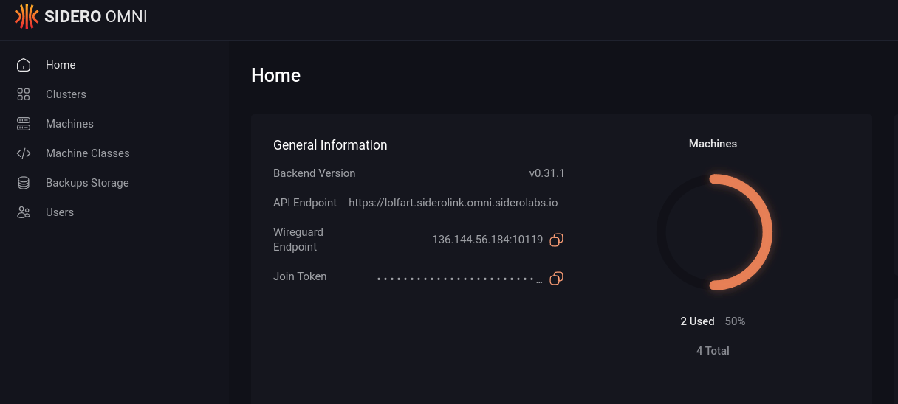

<!-- markdownlint-disable first-line-heading sentences-per-line -->

  
SaaS-simple deployment of Kubernetes - on your own hardware.

  

    
    
  

---

Omni manages Kubernetes on bare metal, virtual machines, or in a cloud.
Built on [Talos Linux](https://talos.dev) by the folks at [Sidero](https://siderolabs.com).

Boot from an Omni image.
Click to allocate to a cluster.
That’s it!

- Vanilla Kubernetes, on your machines, under your control.
- Elegant UI for management and operations
- Security taken care of—ties into your Enterprise ID provider
- Highly Available Kubernetes API endpoint built in
- Firewall friendly—manage edge nodes securely
- From single-node clusters to the largest scale
- Support for GPUs and most CSIs

## Install

Omni is available via a [Business Source License](LICENSE) which allows free installations in non-production environments.
If you would like to deploy Omni for production use please contact [Sidero sales](mailto:sales@siderolabs.com).
If you would like to subscribe to the hosted version of Omni please see the [SaaS pricing](https://www.siderolabs.com/pricing/).

If you would like to self-host Omni for non-production workloads please follow the [instructions in the documentation](https://omni.siderolabs.com/how-to-guides/self_hosted/index).

To deploy Omni on Kubernetes, see the [Helm chart](deploy/helm/v2/omni/README.md).

## Development

For instructions on developing Omni, see [DEVELOPMENT.md](DEVELOPMENT.md).

## Community

- Support: Questions, bugs, feature requests [GitHub Issues](https://github.com/siderolabs/omni/issues)
- Slack: Join our [slack channel](https://taloscommunity.slack.com/).
  Request access via [inviter.co](https://inviter.co/sidero-labs-community).
- Twitter: [@SideroLabs](https://twitter.com/SideroLabs)
- Email: [info@SideroLabs.com](mailto:info@SideroLabs.com)

If you're interested in this project and would like to help in engineering efforts or have general usage questions, we are happy to have you!
We hold a weekly meeting that all audiences are welcome to attend.

### Office Hours

- When: Mondays at 16:30 UTC.
- Where: [Google Meet](https://meet.google.com/day-pxhv-zky).

You can subscribe to this meeting by joining the community forum above.

> Note: You can convert the meeting hours to your [local time](https://everytimezone.com/s/599e61d6).

## Contributing

Contributions are welcomed and appreciated!
See [Contributing](CONTRIBUTING.md) for our guidelines.

## Licenses

The Omni code is released under a combination of two licenses:

- The main Omni Server code is licensed under [Business Source License 1.1 (BSL-1.1)](LICENSE).
- The [Omni client library](client) is licensed under [Mozilla Public License 2.0 (MPL-2.0)](client/LICENSE).

When contributing to an Omni feature, you can find the relevant license in the comments at the top of each file.
